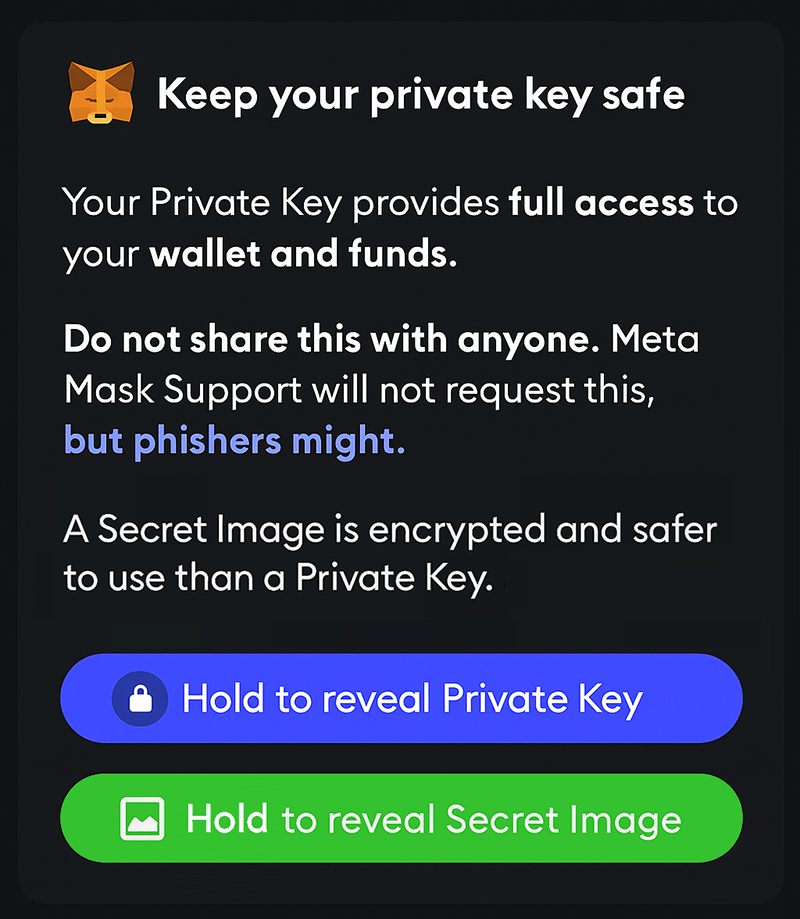

# Roll My Credits 🎬🔐

A steganography application for hiding cryptocurrency seed phrases in movie posters and credit sequences. Created for ETHGlobal Cannes hackathon.

## Overview

Roll My Credits combines traditional steganography techniques with deep learning to securely hide sensitive information (like crypto wallet recovery phrases) in media files. The project offers multiple encoding methods, from simple image manipulation to advanced neural network-based approaches.

## Features

- **Image Steganography**: Hide text in movie posters using traditional LSB or AI-based methods
- **Video Steganography**: Embed messages in movie credit sequences frame-by-frame
- **Custom BIP39 Resolver**: Map movie-themed words to standard crypto recovery phrases
- **Multiple Techniques**: Choose between traditional or deep learning approaches
- **User-Friendly Interface**: React-based web app with intuitive encode/decode workflows
- **Blockchain Integration**: Ethereum smart contract for decentralized word mapping

## Visual Overview

### Steganography Theory

Understanding how information can be hidden in plain sight:


*Basic steganography methodology - hiding data within digital media*

### Real-World Use Cases

Our steganography techniques can be applied to various scenarios where discrete information sharing is essential:

#### Digital Privacy & Security

*Example of visual data exposure vulnerabilities that steganography can help protect against*

#### Secure Information Transfer

*Demonstrating secure data transfer methods to prevent information leaks*

#### Secret Data Import/Export

*Importing sensitive data through seemingly innocent image files*

## Application Interface

### Main Dashboard

*Clean, intuitive interface for encoding and decoding operations*

### Desktop Experience

*Full desktop interface with comprehensive encoding options*

### Mobile Support

*Responsive mobile design for on-the-go steganography*

### Encoding Process

*Step-by-step process of hiding secret messages in images*

### Decoding Process

*Extracting hidden messages from encoded media files*

### Deep Learning Integration

*Advanced AI-powered steganography using neural networks*

### Application Flow

*Complete user journey from encoding to decoding*

## Tech Stack

### Frontend
- **Next.js 12.1.6** + **React 18.1.0**
- **TypeScript** for type safety
- **Sass** for styling
- Responsive design with mobile support

### Backend
- **Node.js** + **Express.js**
- **FFmpeg** for video processing
- **Jimp** & **Sharp** for image manipulation
- RESTful API with file upload support

### Deep Learning
- **PyTorch** for neural networks
- **FastAPI** for serving AI models
- Pre-trained steganography models
- Support for up to 768 characters

### Blockchain
- **Solidity** smart contract
- Custom BIP39 word mapping
- Ethereum-compatible

## Project Structure

```
roll-my-credits/
├── backend/                    # Node.js backend server
│   ├── routes/                # API endpoints
│   ├── services/              # Steganography logic
│   ├── uploads/               # Temporary files
│   └── output/                # Processed files
├── react-boilerplate/         # Next.js frontend
│   ├── components/            # UI components
│   ├── templates/             # Page templates
│   ├── public/posters/        # Movie poster assets
│   └── styles/                # SASS stylesheets
├── deepstego/                 # Python AI steganography
│   ├── models/                # Neural networks
│   ├── api/                   # FastAPI server
│   └── checkpoints/           # Model weights
└── CustomBIP39WordResolver.sol # Smart contract
```

## Installation

### Prerequisites
- Node.js 14.18.1+
- Python 3.8+
- FFmpeg installed
- Git

### Backend Setup

```bash
cd backend
npm install
npm start
```

The backend server will run on `http://localhost:3001`

### Frontend Setup

```bash
cd react-boilerplate
npm install
npm run dev
```

The frontend will be available at `http://localhost:3000`

### Deep Learning Service (Optional)

```bash
cd deepstego
pip install -r requirements.txt
python -m uvicorn api.main:app --reload
```

The AI service will run on `http://localhost:8000`

## Usage

### Encoding a Seed Phrase

1. Navigate to the web interface
2. Select "Encode" mode
3. Choose between poster or video encoding
4. Upload your media file or select from examples
5. Enter your seed phrase or secret message
6. Select encoding method (traditional or AI)
7. Download the encoded file

### Decoding a Message

1. Select "Decode" mode
2. Upload the encoded media file
3. Choose the corresponding decoding method
4. View the extracted message

### Custom BIP39 Words

The smart contract allows mapping custom movie-themed words to standard BIP39 words:
- Deploy the contract to your preferred network
- Use the web interface to configure custom mappings
- Enhanced memorability with themed recovery phrases

## API Endpoints

### Backend API

- `POST /api/steganography/encode-image` - Hide text in image
- `POST /api/steganography/decode-image` - Extract text from image
- `POST /api/steganography/encode-video` - Hide text in video
- `POST /api/steganography/decode-video` - Extract text from video

### Deep Learning API

- `POST /hide` - AI-based text hiding
- `POST /reveal` - AI-based text extraction

## Security Considerations

- Messages are processed locally - no data is stored permanently
- Use strong passphrases for additional encryption
- Verify decoded messages match originals
- Consider using multiple encoding layers for critical data
- Always maintain secure backups of seed phrases

## Development

### Running Tests

```bash
# Backend tests
cd backend
npm test

# Frontend tests
cd react-boilerplate
npm test
```

### Building for Production

```bash
# Frontend build
cd react-boilerplate
npm run build
npm run start

# Backend (already production-ready)
cd backend
npm start
```

## Contributing

1. Fork the repository
2. Create your feature branch (`git checkout -b feature/amazing-feature`)
3. Commit your changes (`git commit -m 'Add amazing feature'`)
4. Push to the branch (`git push origin feature/amazing-feature`)
5. Open a Pull Request

## Use Cases

- **Crypto Wallet Recovery**: Hide seed phrases in personal movie collections
- **Digital Estate Planning**: Embed important information in family videos
- **Privacy Enhancement**: Share sensitive data through innocuous media files
- **Educational Tool**: Learn about steganography and information hiding

## Acknowledgments

- Created for ETHGlobal Cannes hackathon
- Inspired by the intersection of cinema and cryptography
- Movie poster examples from various Ghibli-themed artworks

## License

This project is licensed under the MIT License - see the LICENSE file for details.

## Disclaimer

This tool is for educational and legitimate privacy purposes only. Users are responsible for complying with all applicable laws and regulations. Never share encoded files containing sensitive information through insecure channels.

---

*Roll the credits on traditional security - hide your secrets in plain sight!* 🎬✨